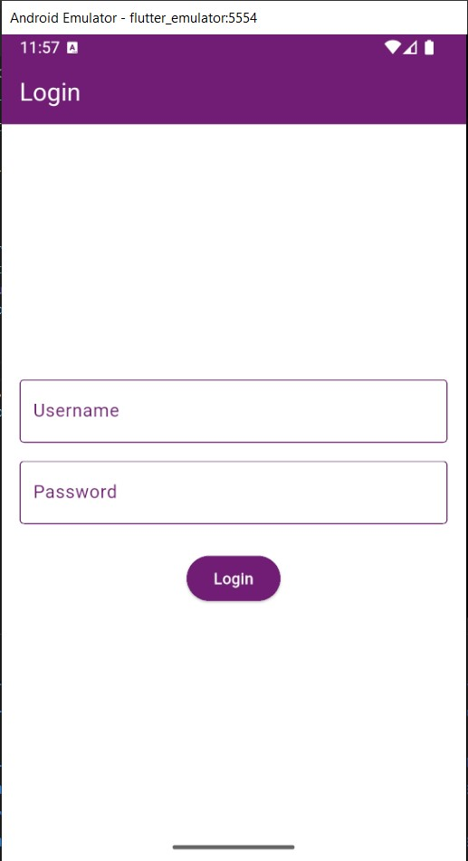
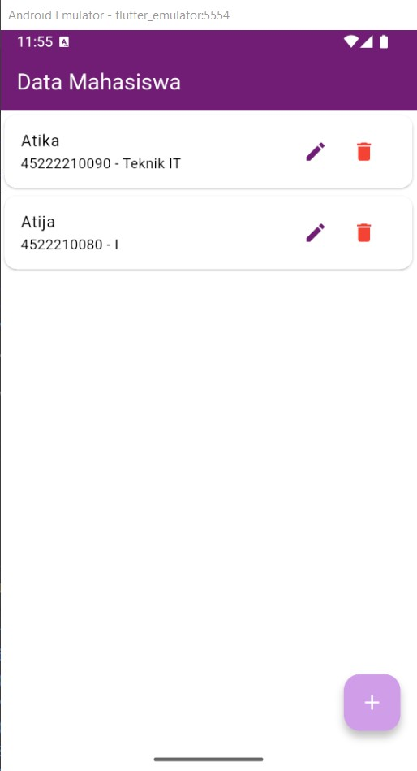
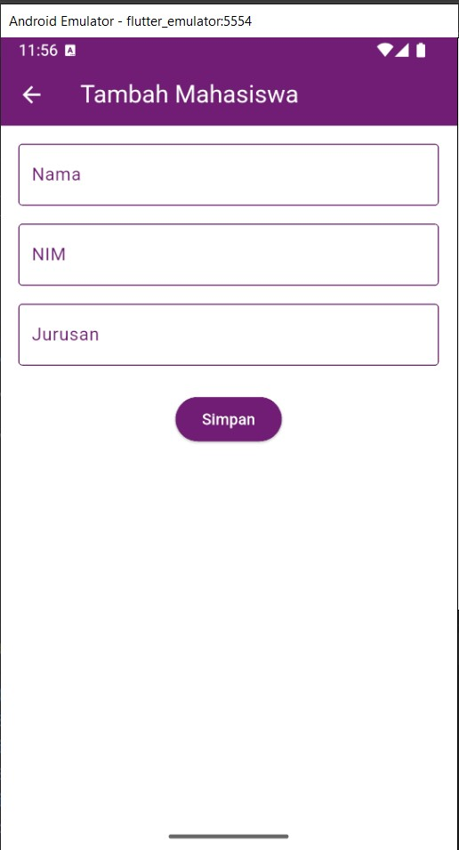
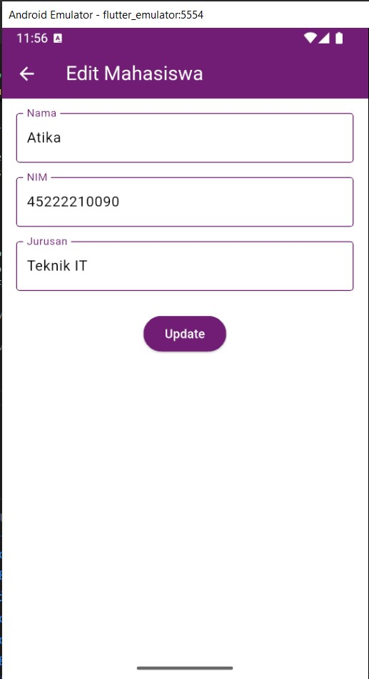

# CRUD Mahasiswa - Aplikasi Flutter

## Deskripsi Aplikasi

Aplikasi ini merupakan aplikasi CRUD untuk pengelolaan data mahasiswa. Pengguna dapat melakukan login, menambah, melihat, mengedit, serta menghapus data mahasiswa.

---

## Fitur

- **Login sederhana** (username dan password adalah 'admin')
- **Melihat daftar mahasiswa**
- **Menambah data mahasiswa**
- **Mengedit data mahasiswa**
- **Menghapus data mahasiswa**
- Semua data tersimpan secara di database SQLite

---

## Screenshot

| Login                 | Home                  |
|-----------------------|----------------------|
|  |  |

| Tambah Mahasiswa         | Edit Mahasiswa         |
|--------------------------|-----------------------|
|  |  |

---

## Penjelasan Tiap Halaman

### 1. **Login**
Halaman ini digunakan untuk masuk ke aplikasi. Cukup masukkan username dan password beruoa 'admin'

### 2. **Home (Daftar Mahasiswa)**
Setelah login, pengguna akan masuk ke halaman utama yang berisi daftar seluruh mahasiswa yang sudah terdaftar.  
Pada setiap baris data mahasiswa, ada tombol edit (ikon pensil) dan hapus (ikon tempat sampah).  
Untuk menambah data baru, klik tombol tambah (+) di pojok kanan bawah.

### 3. **Tambah Mahasiswa**
Halaman untuk menambah data mahasiswa baru.  
Isikan nama, NIM, dan jurusan. Setelah semua terisi, klik tombol **Simpan**. Data yang sudah disimpan akan muncul di halaman utama.

### 4. **Edit Mahasiswa**
Hampir sama dengan tambah, namun field-nya sudah terisi dengan data mahasiswa yang ingin diedit.  
Setelah diubah, klik tombol **Update** agar perubahan tersimpan ke database.

